# Шаломеенко Иван Андреевич
shalomeenkoivan@gmail.com
+79516489072

# Мониторинг процесса

- Для выполнения данного задания  нужно написать bash-скрипт для мониторинга процесса "test", который будет запускаться при загрузке системы (желательно как демон systemd), проверять состояние процесса каждую минуту и, если процесс запущен,  "стучаться" следующий API-адрес: https://test.com/monitoring/test/api, а при перезапуске процесса или проблем с сервером - писать в лог /var/log/monitoring.log

## 0. Подготовка

- Для того, чтобы у нас был процесс test и можно было выполнять задание напишу небольшую программу на С (бесконечный цикл, который на всякий случай будет расходовать CPU):
touch test.c

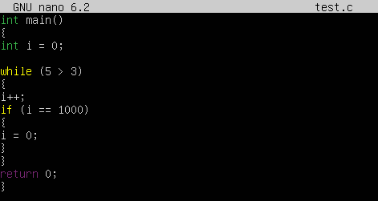

- Компилирую:
gcc -std=c11 -Wall -Wextra -Werror test.c -o test

- Запускаю бинарник в фоновом режиме:
./test &

- Проверяю, что процесс запущен и работает:
ps

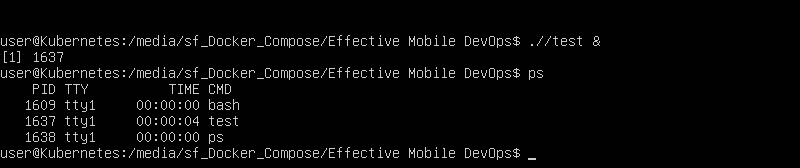

- Далее напишу простой bash-скрипт, который будет выводить на экран информацию о том, найден ли процесс с данным названием среди запущенных или нет:
touch monitoring.sh
chmod +x monitoring.sh

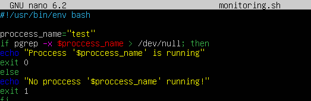

- Проверяю работу скрипта:
bash monitoring.sh

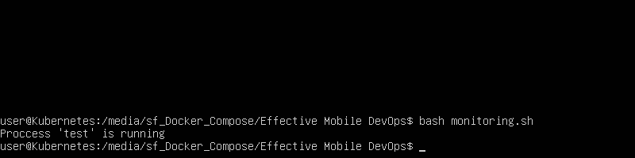

- Отлично, теперь, когда все работает, немного модернизирую скрипт, чтобы пока что данная информация писалась в лог, а не выводилась на экран (потребуется для отладки при выполнении следующих пунктов задания):

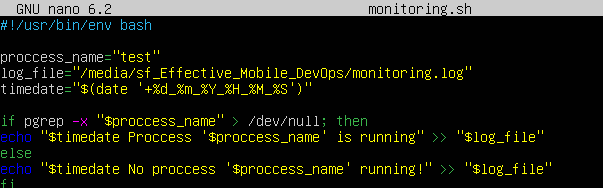

## 1. Настройка автозапуска нашей системы мониторинга через systemd unit

- Чтобы наш bash-скрипт запускался при загрузке системы, создадим файл сервиса для systemd:
touch monitoring.service

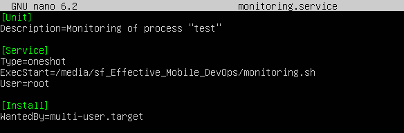

- Копирую unit-файл в системный каталог:
sudo cp /etc/systemd/system/monitoring.service

- Перезагружаю демон systemd для применения изменений:
sudo systemctl daemon-reload

- Включаем сервис в автозагрузку:
sudo systemctl enable monitoring.service

## 2. Настройка периодического запуска скрипта мониторинга каждую минуту

- Выполнить этот пункт задания можно следующими способами:
1) добавить в скрипт цикл и изменить так, чтобы он "висел" как демон в фоне (еще нужно будет изменить в unit-файле параметр type c oneshot на simple)
2) сделать так, чтобы скрипт вызывался каждую минуту через systemd-timer

- Выберу способ №2, для этого создам следующий файл:
touch monitoring.timer

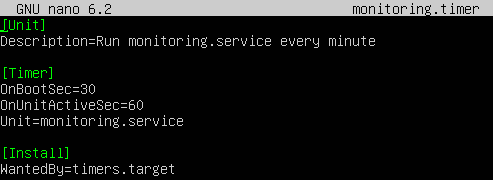

- Копирую в системный каталог:
sudo cp monitoring.timer /etc/systemd/system/

- Чтобы задействовать таймер:
sudo systemctl daemon-reload
sudo systemctl enable --now monitoring.timer

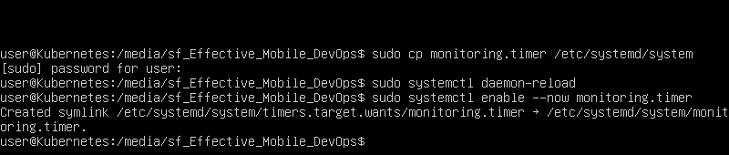

- Проверяем, что таймер установлен:
systemctl list-timers | grep monitoring

- Перезапустим систему:
sudo reboot

- Теперь запустим снова наш процесс и посмотрим лог:
./test &
cat monitoring.log

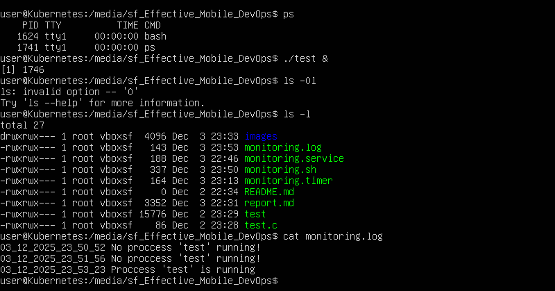

## 3. Интеграция HTTPS-запроса в скрипт мониторинга при запуске процесса

- Теперь снова модифицируем наш monitoring.sh, но уже так, чтобы при наличии процесса test выполнялся HTTPS-запрос на https://test.com/monitoring/test/api:

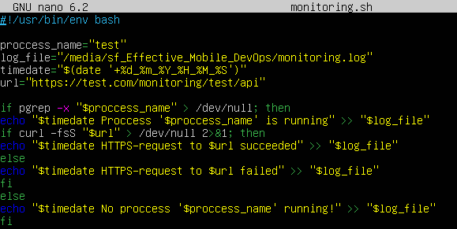

- Проверим логи:
cat monitoring.log

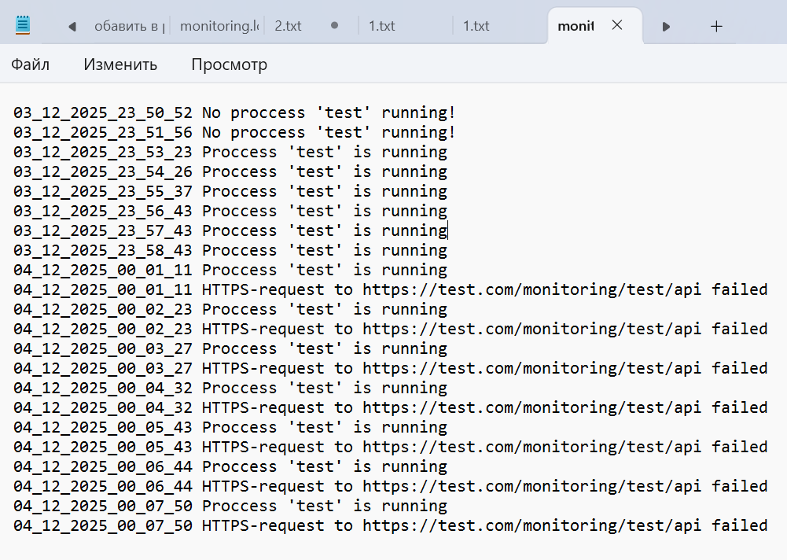

## 4. Логирование в /var/log/monitoring.log при перезапуске процесса

- Снова модифицируем наш bash-скрипт таким образом, чтобы в /var/log/monitoring.log добавлялась запись, если процесс был перезапущен (создаем файл test_state, где храним состояние процесса и при каждом запуске сравниваем текущее с предыдущим), если процесс запущен - просто "стучимся" по https://test.com/monitoring/test/api, если процесс не запущен - ничего "не делаем", как и сказано в задании:

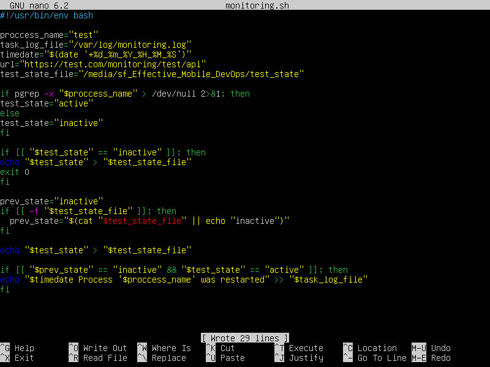

- Перезапустим процесс несколько раз, чтобы убедиться, что пункт задания выполнен корректно:
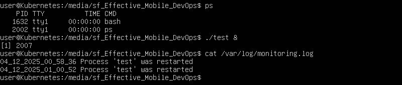

## 5. Логирование в /var/log/monitoring.log в случае, если сервер не доступен

- Осталось добавить в скрипт, после проверки того, что процесс test запущен, выполнение HTTPS‑запрос к https://test.com/monitoring/test/api с помощью curl, и, в случае ошибки, добавлять соответствующую запись в лог:

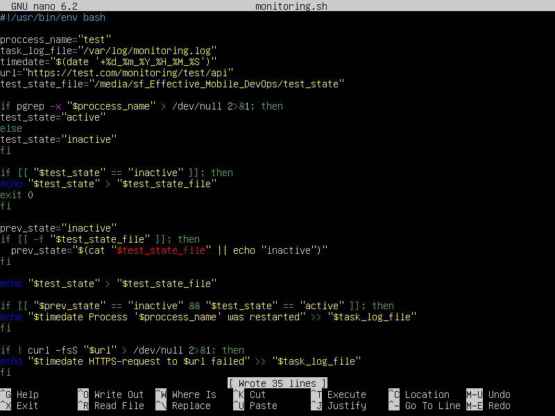

- Проверим лог:
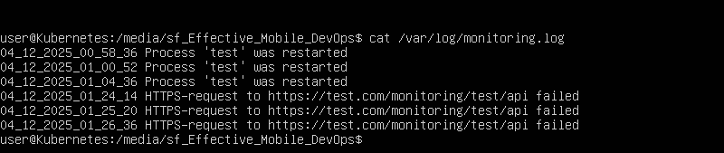

- Таким образом, в рамках тестового задания реализован полный цикл мониторинга процесса test, а именно: скрипт запускается при старте системы через unit и timer systemd, каждую минуту проверяет состояние процесса, при его наличии выполняет HTTPS‑запрос к https://test.com/monitoring/test/api, логирует перезапуски процесса и случаи недоступности сервера мониторинга в /var/log/monitoring.log. Все размышления и шаги наглядно продемонстрированы и задокументированы скриншотами.

- Осталось  добавить все используемые файлы решения (test.c, monitoring.sh, monitoring.service, monitoring.timer, report.md, а так же папку /images с изображениями) в публичный репозиторий GitHub:
https://github.com/shalomeenkoivan-del/effective_mobile_devops
